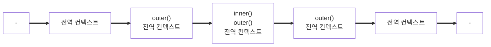

---

## 1. 실행 컨텍스트(execution context)

### (1) 실행 컨텍스트는?

- **실행 할 코드에 제공할 환경 정보들을 모아 놓은 객체**

### (2) 스택과 큐

- Stack : a,b,c,d를 저장하고 꺼낼때는 d,c,b,a 순서로 꺼내는 방법 (후입선출)
- Queue: a,b,c,d를 저장하고 꺼낼때 a,b,c,d 순서로 꺼내는 방법 (선입선출)

### (3) 실행 컨텍스트 구성 방법

- 전역공간
- `eval()` 함수
- 함수

```jsx
// --------------------------------  전역 컨텍스트

var a = 1;

function outer() {
  function inner() {
    console.log(a); // undefined
    var a = 3;
  }
  inner(); //--------------------- inner 실행 컨텍스트
  console.log(a); // 1
}

outer(); //------------------------ outer 실행 컨텍스트
console.log(a); // 1
```

**(1) 콜 스택 쌓이는 순서**



- 코드를 실행하면 전역 컨텍스트가 콜 스택에 먼저 담김
- `outer()`함수를 호출하면 `outer()`에 대한 환경 정보를 수집해서 `outer()` 실행 컨텍스트를 생성하고 콜 스택에 담는다
- `outer()`에 담긴 `inner()` 함수의 실행 컨텍스트를 콜 스택에 담는다
- `inner()` 함수가 콜 스택 가장 위로 쌓이면 a 변수에 값 3을 할당하고
- `inner()` 함수를 콜 스택에서 제거
- `inner()` 함수 종료
- `inner()` 함수 다음 줄 `console.log`를 출력
- `outer()` 함수를 콜 스택에서 제거
- `outer()` 함수가 종료
- `outer()` 함수 다음 줄 `console.log`를 출력
- 전역 컨텍스트는 실행할 코드가 남아 있지 않아서 다시 제거된다

**스택 구조는 실행 컨텍스트가 콜 스택 맨 위에 쌓이는 순간 현재 실행할 코드에 관여하게 되는 시점이다**

**여기서** **실행 컨텍스트의 수집 정보**

- **Variable Environment** : 현재 컨텍스트 내의 식별자들에 대한 정보 , 외부 환경 정보 , 선언 시점의 **Lexical Environment** **snapshot** , **변경 사항은 반영되지 않는다**
- **Lexical Environment** : 처음엔 **VariableEnvironment**와 같지만 **변경 사항이 실시간으로 반영된다**
- **ThisBinding** : this 식별자가 바라봐야할 대상 객체

## 2. Variable Environment

- 실행 컨텍스트 생성 중 생성 단계의 정보
- 함수 내의 코드 실행 직전에 생성
- **Environment Record는 컨텍스트 내부를 처음부터 끝까지 순서대로 식별자 정보(`이름,함수선언,변수명 등`)를 수집하여 작성됌 ( 식별자의 바인딩 정보가 담겨있지만 , 어떤 값이 할당되었는지는 관심이 없다)**
- 따라서 변수 선언만 끌어올리고 원래 자리에 남겨두는 호이스팅이 발생함 (할당은 **Lexical Environment의 Environment Record에만 갱신됌**

## 3. **Lexical Environment**

- 이미 만들어진 Varibale Environment를 복사
- 코드를 실행하면서 변수에 값이 할당되거나 변경되면 **Lexical Environment에만 업데이트시킴**

### **(1)** **Environment Record와 Hoisting**

- **Environment Record는 컨텍스트 내부를 처음부터 끝까지 순서대로 식별자 정보를 수집하였으니 코드가 실행 전임에도 불구하고 자바스크립트 엔진은 이미 해당 환경에 속한 변수명을 다 아는것**
- **엔진의 실제 동작 방식 대신에 ‘자바스크립트 엔진은 식별자들을 최상단으로 끌어올리고 나서 실제 코드를 실행한다’라고 생각해도 문제가 없을 것 ⇒ 실제로 끌어올리지는 않지만 편의상 끌어올린 것 (호이스팅의 개념)**

**(1) 코드로 이해해보는 Hoisting 규칙**

- **예시 코드**
- **호이스팅이 안된다고 가정하면 각각의 값은 이렇게 찍힐 것이다.**

```jsx
function a(x) {
  console.log(x); // 1
  var x;
  console.log(x); // undefined
  var x = 2;
  console.log(x); // 2
}

a(1);
```

**실제 구동되는 결과는 ?**

- **Environment Record는 식별자에만 관심있지 어떤 값이 할당될건지는 관심없다**
- **실행 전 식별자 정보를 모두 수집했으니 1,1,2가 나온다**

```jsx
function a(x) {
  // 수집 대상 1 (매개변수)
  console.log(x); // 1
  var x; // 수집 대상 2 (변수 선언)
  console.log(x); // 1
  var x = 2; // 수집 대상 2 (변수 선언)
  console.log(x); // 2
}

a(1);
```

- **그래서** **매개변수를 변수 선언/할당과 같다고 간주해서 변환하면?**
- **위 코드는 아래 코드와 결과값이 같다**

```jsx
function a() {
  // 수집 대상 1 (매개변수)
  var x = 1;
  console.log(x); // 1
  var x; // 수집 대상 2 (변수 선언)
  console.log(x); // 1
  var x = 2; // 수집 대상 2 (변수 선언)
  console.log(x); // 2
}

a();
```

- **Environment Record에 맞춰 여기서 호이스팅 처리를해서 변수명만 끌어 올리고 할당은 남겨두자면**

```jsx
function a() {
  var x; // 수집 대상 (1) (변수 선언)
  var x; // 수집 대상 (2) (변수 선언)
  var x; // 수집 대상 (3) (변수 선언)

  x = 1; // 수집 대상 1 (할당 부분1)
  console.log(x); // 1
  console.log(x); // 1
  x = 2; // 수집 대상 2 (할당 부분2)
  console.log(x); // 2
}

a();
```

**코드 실행 과정**

- 수집 대상 (1)의 `변수 x`를 선언 ⇒ 저장 공간 메모리 확보 , 주솟값을 `변수 x`에 연결함
- 수집 대상 (2),(3)은 다시 `변수 x`를 선언 ⇒ 근데 이미 선언된 `x`가 있으니 무시한다
- 할당 부분1에서 `x`에 `1`을 할당 , 숫자 `1`을 메모리에 담고 `x`와 연결된 메모리 공간에 숫자 `1`을 가리키는 데이터 주솟값을 입력한다
- 첫번째 할당을 마친 `console.log(x)` 출력 두개 모두 1이 출력된다
- 할당 부분2에서 `x`에 `2`를 할당 , 숫자 `2`를 별도의 메모리에 담고 x에 연결된 메모리 주소로 이동
- 기존에 숫자 1을 가리키는 주솟값을 숫자`2`로 가리치는 주솟값으로 대치한다
- 두번째 할당을 마친 `console.log(x)` 출력엔 `2`가 출력된다
- 실행 컨텍스트가 콜 스택에서 제거된다

**(2) 함수 선언의 Hoisting 규칙**

- 여기서 **Hoisting**을 생각 안하고 결과값을 생각하면 이런 식으로 나올것이다
- (1)에선 `console.log`에선 값을 할당 안했으니 당연히 `undefined`
- (2)에선 `‘bbb’`를 할당했으니 `‘bbb’`
- (3)에선 `function b`

```jsx
function a() {
  console.log(b); // (1) 'undefined'
  var b = "bbb";
  console.log(b); // (2) 'bbb'
  function b() {}
  console.log(b); // (3) function
}

a();
```

- **그치만 결과는 다음과 같다**
- **여기서 변수는 선언부 , 할당부를 나누어서 선언부만 끌어올리지만 함수 선언은 함수 전체를 끌어올린다 따라서 우선적으로 변수 `var b = ‘bbb’`가 변수 선언부 `var b;`로 올라가고 함수 선언 `function b(){}`는 `var b = function b(){}`가 된다**

```bash
[Function: b]
bbb
bbb

[Done] exited with code=0 in 0.05 seconds
```

**위 코드를 이해하고** **Hoisting을 생각해서 코드 동작을 변환하면**

```jsx
function a() {
  var b; //  수집 대상 (1)
  var b = function b() {}; //  수집 대상 (2)
  console.log(b); // (1)
  var b = "bbb"; // 데이터 할당(1)
  console.log(b); // (2)
  console.log(b); // (3)
}

a();
```

- 첫번째로 수집 대상에서 `var b;`를 수집한다, 메모리는 저장 공간 확보 후 주솟값을 변수 b에 연결시킨다
- 이제 선언된 `변수 b`에 `function b`를 메모리에 할당한다 (`변수 b`는 함수를 가리킴)
- (1)에서는 `function b`를 할당했으니 `[Function: b]`를 출력한다
- 다시 `변수 b`는 `‘bbb’`를 할당한다 기존에 함수가 저장된 주솟값을 `‘bbb’`가 담긴 주솟값으로 덮어쓴다
- b는 선언된 변수에 `‘bbb’`를 가리킨다
- (2) , (3)은 모두 `‘bbb’`를 출력한다
- 실행 컨텍스트가 콜 스택에서 제거된다

**(3) 함수 선언문과 함수 표현식**

- 함수 선언문 : function 정의부만 존재하고 별도의 할당 명령이 없는것
- 함수 표현식 : function을 별도의 변수에 할당하는 것

함수 표현식에는 두가지 종류가 있는데 일반적으론 익명 함수 표현식을 말함

- 기명함수 : 함수명을 정의한 함수 표현식
- 익명함수 : 함수명을 정의 안한 함수 표현식

```jsx
// 함수 선언문
function a() {}
console.log(a); //실행 ok
```

```jsx
// 함수 표현식 (익명 함수)
var b = function () {};
b(); //실행 ok
```

```jsx
// 함수 표현식 (기명 함수)
var c = function d() {};
c(); //실행 ok
d(); //에러!
```

여기서 기명함수는 외부에서 함수명으로 함수를 호출할 수 없다.

**함수 선언문과 함수 표현식의 차이**

- 원본코드

```jsx
console.log(sum(1, 2));
console.log(multiply(3, 4));

function sum(a, b) {
  return a + b;
}

var multiply = function (a, b) {
  return a * b;
};
```

- 이 코드를 호이스팅 처리 동작 코드로 만들면

```jsx
// (1) 함수 선언문은 전체 호이스팅 처리
function sum(a, b) {
  return a + b;
}

// (2) 변수 선언부 가져옴

var multiply;

console.log(sum(1, 2)); // 3
console.log(multiply(3, 4)); // TypeError: multiply is not a function

multiply = function (a, b) {
  return a * b;
};
```

- 첫번째로 함수 선언문을 최상단으로 올려 메모리 공간 확보하고 주솟값을 변수 `sum`에 연결
- 그 다음 변수 선언부를 끌어올려 메모리 공간을 확보하여 주솟값 변수 `multiply`에 연결함
- `console.log(sum(1,2))` 에서 `sum`에 데이터 `1`과`2`를 할당하고 `sum`의 결과값 `3`을 출력
- `console.log(multiply(3,4))`는 변수 선언부 `var multiply`에 데이터 `3`,`4`를 할당했는데 `multiply`에는 어떠한 값도 할당되어 있지 않다.. 그래서 `TypeError: multiply is not a function` 에러를 출력
- 런타임 종료 후 실행 컨텍스트 콜스택 제거

함수 선언문은 전체를 호이스팅한 것에 비해 함수 표현식은 변수 선언부만 호이스팅했다. 여기서 중요한건 함수도 하나의 값으로 취급 한다는 것이다.

**함수 선언문의 위험성과 차이**

- A 개발자가 단순한 `sum` 함수로 단순한 `a+b`를 만들어서 여기 저기 호출해서 활용했었는데 B라는 초보 개발자가 `x`,`y`를 받아 `x+y+=(x+y)`를 반환하는 함수를 만들었고 B는 작성한 함수 이후에만 영향을 줄것이라고 생각해서 배포까지한다. A 개발자가 의도한 함수가 아닌 다른 문자열 반환을 해버리는 문제가 발생한다
- 코드가 5000줄 이상이라고 생각하면 오류를 잡아내기 쉽지 않다 (`sum`은 에러 반환을 하지 않고 숫자 대신 문자열을 넘겨받아도 암묵적 형변환에 따라 오류없이 통과됌)

```jsx
console.log(sum(1, 2));

function sum(a, b) {
  return a + b;
}

var a = sum(1, 2);

function sum(x, y) {
  return x + "+" + y + "=" + (x + y);
}

var c = sum(1, 2);
console.log(c);
```

- **따라서 상대적으로 함수 표현식이 안전하다**

```jsx
console.log(sum(3, 4)); // sum is not a function

var sum = function (a, b) {
  return a + b;
};

var a = sum(1, 2);

console.log(a); // 3

var sum = function (x, y) {
  return x + "+" + y + "=" + (x + y);
};

var c = sum(1, 2); // 1+2=3
console.log(c);
```
